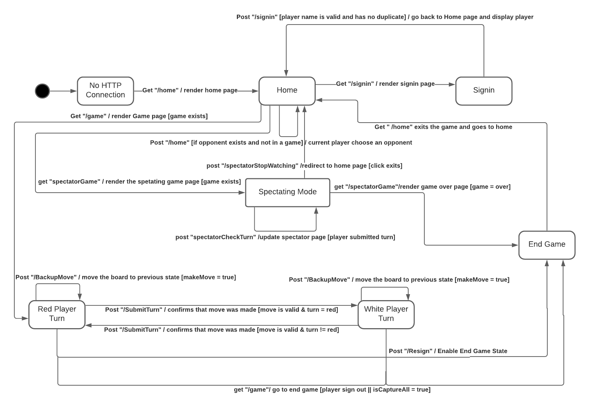

# PROJECT Design Documentation

## Team Information
* Team name: Shiba
* Team members
  * Quang Tran
  * Thomas Bertola 
  * Julia Han
  * Cooper Mistishin
  * Rachel Ogawa

## Executive Summary

This is a web-based application of the game checkers. This checkers game follows the standard American rules. A game of 
checkers is to be played with two players who can resign at any time, and a player can choose who to play the game against.

### Purpose
The purpose of the game is having two players play regular Check Game with a board of
8x8 grid following the American rules.

### Glossary and Acronyms

| Term | Definition |
|------|------------|
| VO | Value Object |

## Requirements

This section describes the features of the application.

### Definition of MVP
The MVP of this project designing the feature of a basic Checker Game which relating to check for
implement movements' validation and how movements would change the game's board. 

### MVP Features
Players can signin and start a game.
The creation of a Checker Game.
The Players can make all the movements and jumps required in a Checkers Gamg.
A way for Player to resign from a Checker Game.

### Roadmap of Enhancements
A way for players to Pause and Resume the game.
The option for Players to watch someone else's game in Spectator Mode.
The option for Players to Play a game against an AI Player.

## Application Domain

A player entity is a user of the web checkers application that signs in with a name as their ID. Once a player selects an opponent,
or chooses to play against an AI opponent, the player plays a check game. During this checker game, the player with perform movements if possible. These movements 
will be performed on the pieces on the checkerboard.

A CheckerGame entity represents a game of checkers that two players will play. This checker game includes a board that 
is 8x8 giving the board 64 squares that have a red or white color. A piece can reside on a square and can be either a king
or a single piece. In total, there are 12 pieces per player. A checker game could have a spectator mode in which a player currently
not playing can spectate the game currently happening 

The Movement entity handles the movement each player can make. Because this game follows the American Rules, each player must 
make a move each turn. There are 3 kinds of movements. A single move moves a piece to a diagonal space. 
A single jump is a jump move over an opponents piece, this jump results in the capture of the opponents piece. A multiple jump
is a succession of jumps over pieces of an opponent in which each piece jumped over is captured. 

## Architecture and Design

This section describes the application architecture.

### Summary

The following Tiers/Layers model shows a high-level view of the webapp's architecture.

As a web application, the user interacts with the system using a
browser.  The client-side of the UI is composed of HTML pages with
some minimal CSS for styling the page.  There is also some JavaScript
that has been provided to the team by the architect.

The server-side tiers include the UI Tier that is composed of UI Controllers and Views.
Controllers are built using the Spark framework and View are built using the FreeMarker framework.  The Application and Model tiers are built using plain-old Java objects (POJOs).

Details of the components within these tiers are supplied below.

### Overview of User Interface

When a player initially connects to the application, they will direct to the homepage where they will have an option to 
sign in if they have not done so already. When a player selects sign in, they will be taken to the sign-in page in which 
they can enter a valid username. Once a valid username is entered, the user will be taken back to the updated home page
that consists of all currently signed in players that the user can challenge to a game. Once the user challenges another
player or the user is challenged by another player, they will be taken to a game page that displays the checkerboard. 

### UI Tier
The UI classes are broken up into two actions, the get and the post actions. The get action is the initial display of
information while the post will update a view with new information. The Get Game, Home and Signin routes display the game
view of webcheckers, the home screen of webcheckers and the signin page of webcheckers. The Post Game, Home and Signin
routes all update the original game, home and signin displays with new information.

The PostHomeRoute is responsible for updating the home menu with players that are currently playing. This UI class will
also allow players to select an opponent to play checkers against.
The rest of the post route classes
are for the game logic of webcheckers. The CheckTurn route will see if it is a players turn and update each player with
who's turn it is.

The ValidateMove route will see if a players projected move is valid following the American Rules of
checkers. A Gson is used to capture moves made on the board to reference later. The BackupMove route will back the board
up to it's previous position after a move has been attempted, and the
SubmitTurn route will finalize a turn and update the board.

To create a game, the user will encounter different UI changes. The following figure shows how the UI is 
changed as the user enters information.

The sequence diagram above shows the functionality of getting a game page from user. The actions performed by the player
are obtained through the session and by setting up the View Model to render the game page. The data it needs is getting
from the information generating by CheckerGame, GameCenter and BoardView class. 

The sequence diagram above shows the functionality of checking whether a player's move is valid. The checking performed by
haing the player makes a move, then tranfer that movement from Json to check whether it's valid. Then convert the message
to Json class and pass it back to the session to display message to user. 

### Application Tier
  The application tier consists of the GameCenter and PlayerLobby classes. The PlayerLobby
represents an object that encapsulates all of the players currently signed into the WebCheckers application.
It functions by utilizing a hashmap to keep a list of all the players currently signed into the game
and is responsible for adding players to this hashmap as well as determining how many players are
currently signed in. It also has the responsibility of checking whether a name entered is available
by checking if the name is already within the hashmap of players already signed in.
  The application tier also contains the GameCenter class. This class is responsible for keeping track of players and the games they are
currently playing. The class has the ability to update the turn of the player (i.e. determine whether it is the 
selected player's turn to move a piece), as well as check if the player is currently active within the game through
boolean expressions. The GameCenter class may also check if the game is a two player game and whether a player is
currently in a game. It is also responsible for flipping the board in order to return the opponent's view correctly and
add players to a game.

### Model Tier
  The model tier consists of 8 classes. The first class is the BoardView. This component is responsible for checking, 
maintaining, and updating the game board for a WebCheckers game.
  The next class is the CheckerGame class which is responsible for a specific checker game being played. It has the 
ability to add and apply moves made on the specific game board as well as getting the winner of the game, checking
whether the game is over, setting the game status, and checking for valid moves.
  The Move class is responsible for a single move in a WebCheckers game. It has the ability to get end and start position
of a piece, as well as the inverse of these positions in order to accurately represent the move on the opponent's board.
  The Piece class is responsible for representing a single piece in a WebCheckers game. It has two possible types: king or
single, as well as two possible colors: red or white. This class can set and get the type and color of any piece in the
game.
  The Player class is the object class representing a single player in a WebCheckers game. It can get the name of any
player and is responsible for rendering a player.
  The Position class is the object class representing a position in a WebCheckers game. It can get the cell and row of a
position. It is responsible for checking if a position is out of range as well.
  The Row class is the object class representing a row in a WebCheckers game. It can get the index and spaces of a row,
as well as set the spaces of a row. It is responsible for creating an Iterator of the spaces in a single row.
  The Spaces class is the object class representing a single space on the board. It can get the cellId, color, and piece
occupying a space. It can also set the cellId and piece of a space.This class is also responsible for determining
whether a space is valid for a piece to be moved onto it.

### Design Improvements 
If the project continues, the improvement would be redesign the software design pattern
relating to MVC. Especially relating to controller and model which contains the board and 
how to manipulate the board itself. Since our design have Iterable of Iterables design, it 
violates the Object-Oriented principles

## Testing
We have a result of testing relating to UI and Application tier which is over 90% abd the 
result of our Model tier is over 80% which captures most of the features in our project. 

### Acceptance Testing 
A total of 11 user stories have passed all their acceptance criteria tests. No stories have 
any tests failing, and there are 7 user stories that have not had any testing yet. In sprint 1, 
there were some issues with valid usernames that a player could have and there was also a 
problem that a user was able to start a game with themselves, which needed to be fixed. There 
was also a problem for future implementation where a piece being dropped caused an error. 
In sprint 2, the previous issues have been fixed and there were no other concerns from the 
sprint 2 acceptance criteria testing.

### Unit Testing and Code Coverage 
Our initial plan was to get all the tests to 100% coverage, then as we continued to work on 
sprint 2 we added a significant amount of new elements to be tested. After this, we decided to 
adapt our strategy to simply get all the tests to at least 80% coverage and tried to focus on 
the most important base tests. Overall the coverage is 83%, the model coverage is 83%, the 
application is 71%, and the ui is at 94%. We decided to focus on the more base tests the larger, 
more dense files will rely on the smaller files such as Player and Piece, if these files do not 
run properly then we will have a harder time trying to fix the more complicated files such as 
BoardView. For the most part, we have done pretty well to match our target, although there are 
some tests which still need improvement to meet these targets.

## Enhancements
This section describes the implemented enhancements

### Spectator Mode
The spectator mode enhancement allows for another user logged into the WebCheckers application to
watch another player play a game. When a player signs in and is redirected to the page where they
are prompted to select an opponent, they are also given the opportunity to click a game that is
currently active to spectate that game. In the spectator state, the user is unable to click any of
the pieces or interact with any part of the board or buttons except the button to quit spectating.

This is one of the UI tier components of the spectator. This class handles assigning a spectator to a game by assigning 
the player as spectator and not player. 

### AI Player
The AI player enhancement allows for a user to play against an AI opponent instead of another human
player. When creating an AI player, two lists of moves are generated. One list contains simple
moves or moves that simply move a piece one square diagonally without capturing another piece. The
second list contains any possible jump moves that the AI player is able to make. If the list that
contains possible jump moves is zero, which indicates that there are no possible jump moves, then
a random move is selected from the list of simple moves. The AI player enhancement was implemented so
that a multiple jump move is always taken. It was also implemented that in the event of a multiple jump
move, the jump move list will consist of each individual jump.

### Code Metric Analysis

1. Chidamber-Kemerer metrics

      For Chidamber-Kemerer metrics analysis, all measurements are showed as white color proving there
   is no measurement that does not meet the requirements. In our classes, the CheckGame, Player and 
   GameCenter have the most coupling between objects than other classes since they relate to most of
   the other classes and thus, changing them would affect the results of our application. 
2. Complexity metrics
   
      For Complexity metrics analysis, our AIPlayer and Board class has the most Average operation 
   complexity since they have to deal with good amounts relating to algorithm and possible moves such 
   that an AI player  would make the right decision to play the game correctly. For weighted method
   complexity, we have Board, AIPLayer, GameCenter and CheckerGame to have the red color proving they 
   do not meet the requirements, the reason is they contain a high number of methods to make the application 
   works properly. 
3. Javadoc coverage metrics
   
      Most of our methods contains Javadoc coverage which is being shown by the metrics analysis. Other
   methods that shows as zero are in Unit Tests classes where we believe Javadoc for them is not required.
4. Lines of code metrics
   
      For line of code metrics, Board, AIPlayer, GameCenter and CheckerGame again at the top classes at
   having the most lines of code. This reason could be explained previously where these classes deal
   with most of the functionalities relating to our application. 
5. Martin package metrics
    
      For Martin package metrics, we have model and application package have the high measurement of 
afferent couplings since they are being used by other classes outside their package, they contain 
   the functionalities relating manage user input, logic and rules of the application. UI package has the
   highest measurement for efferent couplings since it requires inputs or logics from other tiers to 
   displaying result to the application. 
      
### Code Metric Recommendation

The only metric analysis that we have is complexity metric where weighted method complexity's measurements appear as
red color showing it does not meet the requirement. Recommendations are applied to these classes to improve our design.

For the AIPlayer, the recommendation for changing the complexity metric would be to not change anything else to the 
class. After reimplementing most methods, the operation complexity was reduced by nearly 5 points, and the average 
cognitive complexity  was dropped by around 30-35 points for each method, and really cannot be 
reduced more than that. To reduce the cognitive complexity, larger functions were broken up into smaller helper functions
 and while and for-loops were reduced to decrease the operation complexity.

The reason it cannot be reduced further is the AIPlayer logic. The AIPlayer is meant to collect 
all possible moves it can make which is a very time-consuming process, hence why the AIPlayer has the highest operation 
complexity. On the user end, they are not affected by this since the AI player moves almost instantaneously. For these 
reasons it is believed the operation complexity should be left alone and not reduced further.

For the other parts such as Board, GameCenter and CheckerGame, they are recommended to change functions by simplifying to
smaller functionalities, so the measurements of average operation complexity's measurements are reduced, and we successfully 
did that. The only thing we recommend to not change is method complexity since these classes represents for functionality 
of the application which explains the high amount of functions it contains, reducing it would cost possible errors to our 
application. 